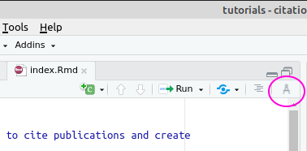
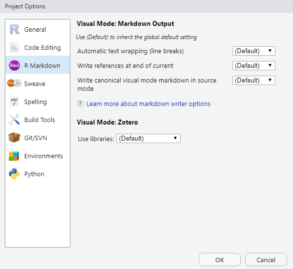
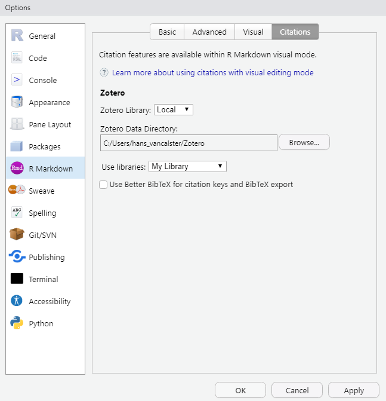

# Enter VME mode

With the advent of RStudio version 1.4+, working with bibliographies and
citing documents in R Markdown has much improved. In this tutorial we
focus on best practices to further ease the citation experience when
working with R Markdown documents. We also give some guidelines specific
to the Research Institute for Nature and Forest.

More general tutorials can be found at the following web pages:

-   <https://rmarkdown.rstudio.com/authoring_bibliographies_and_citations.html>
-   <https://rstudio.github.io/visual-markdown-editing/#/citations>

The latter webpage is part of the documentation about the Visual
Markdown Editing (**VME**) mode that is available since RStudio 1.4+ as
an alternative to writing R Markdown documents in source mode. VME is a
what-you-see-is-what-you-get[1] interface for interacting with R
Markdown. This interface is similar to writing documents in word
processing software (google docs, MS Word, …). Moreover, the VME mode
has more functionalities for citations than the source mode. To switch
between source mode and VME, press the  button :

In this tutorial, we assume you are familiar with the basics of [R
Markdown](https://bookdown.org/yihui/rmarkdown/) or
[Bookdown](https://bookdown.org/yihui/bookdown/).

# Preparing your R Markdown document to work with citations

There are various places where you can specify things that impact
working with citations. The most important are specifications you can
provide in the YAML header of your R Markdown document. Next to that,
the RStudio global and project options provide some additional settings.

## Document level specifications (YAML header specifications)

### Specifying a bibliography

You can specify one or more bibliography files with the `bibliography`
argument in a number of formats, including the most commonly used
formats at the Research Institute for Nature and Forest: CSL-JSON,
CSL-YAML, BibTex and EndNote.

We strongly recommend however to [use CSL-JSON or
CSL-YAML](https://rmarkdown.rstudio.com/authoring_bibliographies_and_citations.html),
since CSL is the native format for Pandoc.[2] All other bibliographic
formats are internally converted to CSL-JSON, but with the exception of
CSL-YAML this can in general not be perfect. Compared to CSL-JSON,
Pandoc’s CSL-YAML has identical contents while having the most
human-friendly syntax.
[CSL-JSON](https://citeproc-js.readthedocs.io/en/latest/csl-json/markup.html)
is the formal standard supported by all CSL processors[3] .

Some example specifications:

    ---
    author: Research Institute for Nature and Forest
    date: '`r format(Sys.Date())`'
    bibliography: references.yaml
    ---

Note that it is not even necessary at this stage that the bibliography
file exists. It is possible to just give it a name and [start adding
citations in VME mode](#citing-documents). When the first citation is
inserted, for instance from a linked Zotero database, the file will be
automatically created and the reference will be added to the file.

For users of Endnote, we recommend to export selected references to
BibTeX format (as far as we know, it is not possible to export to
CSL-JSON format). To do this:

-   Edit -&gt; Output Styles -&gt; Open style manager and check the
    BibTex Export entry

-   make sure that BibTex Export is checked in the Edit -&gt; Output
    styles menu as well

-   File -&gt; Export, select Text file from the file type dropdown menu
    and save the file as `<filename>.bibtex`

We recommend to only include references in the bibliography file that
are cited in the document.

    ---
    author: Research Institute for Nature and Forest
    date: '`r format(Sys.Date())`'
    bibliography:
    - path/to/my/ref.json
    - other_references_from_endnote.bibtex
    ---

### Specifying a citation style

The Research Institute for Nature and Forest has its own citation style.
There is a separate [tutorial](../style_inbo_bibliography/) that shows
how to use this style in various reference manager software.

Specifying a citation style is done in the YAML header using the `csl`
argument. The `csl` argument should be a path or URL to a CSL style
file. To specify the style file for the Research Institute for Nature
and Forest it is best to use the URL of the most up to date version:

    ---
    author: Research Institute for Nature and Forest
    date: '`r format(Sys.Date())`'
    bibliography: ref.json
    csl: https://raw.githubusercontent.com/citation-style-language/styles/master/research-institute-for-nature-and-forest.csl
    ---

### Other YAML citation arguments

The [ymlthis field
guide](https://ymlthis.r-lib.org/articles/yaml-fieldguide.html#citations-1),
[Pandoc](https://pandoc.org/MANUAL.html#other-relevant-metadata-fields)
& associated
[citeproc](https://github.com/jgm/citeproc/blob/master/man/citeproc.1.md)
documentation and [RStudio VME citations
section](https://rstudio.github.io/visual-markdown-editing/#/citations)
mention the following useful arguments:

`citation-abbreviations`

:   Path to a CSL abbreviations JSON file, which can be used to
    translate from full journal titles to abbreviated journal titles.
    Examples of such files can be found
    [here](https://github.com/citation-style-language/abbreviations).

`link-citations`

:   Logical. Add citations hyperlinks to the corresponding bibliography
    entries? Default is `false`.

`nocite`

:   Citation IDs (`@item1`) to include in the bibliography even if they
    are not cited in the document. Including the wildcard pattern `@*`
    will include all citations in the bibliography regardless of whether
    they are cited in the document.

`suppress-bibliography`

:   Logical. Suppress bibliography? Default is `false`.

`lang`

:   Locale to use in formatting citations. If this is not set, the
    locale is taken from the default-locale attribute of the CSL file.
    `en-US` is used if a locale is not specified in either the metadata
    or the CSL file.

`reference-section-title`

:   If this has a value, a section header with this title will be added
    before the bibliography. If `reference-section-title` is not
    specified and the document ends with a section header, this final
    header will be treated as the bibliography header.

`zotero`

:   Specify one or more Zotero libraries. Or `false` to turn of Zotero
    library entirely.

Here is an example of a valid YAML with all citation arguments (“yes”
and “no” serve as alternatives to `true` and `false`):

    ---
    author: Research Institute for Nature and Forest
    date: '`r format(Sys.Date())`'
    bibliography: ref.json
    csl: https://raw.githubusercontent.com/citation-style-language/styles/master/research-institute-for-nature-and-forest.csl
    citation-abbreviations: abbreviations.json
    link-citations: true
    nocite:
    - '@item1'
    - '@item2'
    suppress-bibliography: false
    lang: en-US
    zotero: 'no'
    ---

## Rstudio project and global options

The project options allow you to select a Zotero reference manager
library or libraries for the RStudio project you are working in. The
default will detect your local Zotero library. It is also possible to
point to other libraries, which can include a [group
library](https://rstudio.github.io/visual-markdown-editing/#/citations?id=group-libraries)
that is shared among co-workers.

The global options are more or less the same as the project options but
will apply to all your RStudio projects. The defaults are OK.

# Citing documents

## Syntax

The following Markdown syntax is used to refer to documents. It is based
on citation keys and the basic building block is `@citationkey`.

| syntax                                                               | result (depending on chosen csl style)                                                                      |
|----------------------------------------------------------------------|-------------------------------------------------------------------------------------------------------------|
| `@adams1975` concludes that …                                        | [Adams](#ref-adams1975) ([1975](#ref-adams1975)) concludes that …                                           |
| `@adams1975[p.33]` concludes that …                                  | [Adams](#ref-adams1975) ([1975, p. 33](#ref-adams1975)) concludes that …                                    |
| … end of sentence `[@adams1975]`.                                    | … end of sentence ([Adams, 1975](#ref-adams1975)).                                                          |
| … end of sentence `[see @adams1975,p.33]`.                           | … end of sentence (see [Adams, 1975, p. 33](#ref-adams1975)).                                               |
| delineate multiple authors with colon: `[@adams1975; @aberdeen1958]` | delineate multiple authors with colon: ([Aberdeen, 1958](#ref-aberdeen1958); [Adams, 1975](#ref-adams1975)) |

## Insert a citation

You can either type the syntax in source mode, or use the insert
citation button in VME mode. Using the VME mode has multiple benefits:

-   autocompletion: typing `@` will automatically show a list of
    available references

-   searching and inserting references using one of the following
    methods (from the menu: Insert -&gt; Citation; or shortcut
    CTRL+SHIFT+F8)

    -   From the bibliography or bibliographies referred to in the YAML
        header’s `bibliography` field
    -   From a Zotero library
    -   From DOI
    -   Crossref
    -   DataCite
    -   PubMed

This means that the Zotero reference manager is highly recommended when
you want to work smoothly with citations in R Markdown. This reference
manager also integrates nicely with other word processing software such
as MS Word and Googledocs.

# Bibliography placement

By default, the bibliography will be placed at the end of the document.
So, you will want a final header titled `# References` or
`# Bibliography` at the end your document. See also the
`reference-section-title` field that we discussed in [Other YAML
citation arguments](#other-yaml-citation-arguments).

If you want to place the bibliography somewhere else, for instance
before the appendices, you can insert a `div` html tag in source mode:

    # References

    

    # Appendix

If you use [the `bookdown::gitbook` output
format](https://bookdown.org/yihui/bookdown/html.html#gitbook-style),
further tweaks are possible. This format allows you to write a html
report or book that consists of multiple html pages. You can for
instance choose to split each chapter of a report into separate html
pages. In that case, by default, the bibliography is split and all
citation items that are cited on a given html page are put at the end of
that page, so that readers do not have to navigate to a different
bibliography page to see the details of citations. This feature can be
disabled by setting the `split_bib` YAML field to FALSE, in which case
all citations cited in the entire report or book are put on a separate
bibliography page. To do this, you can add specific keys in the YAML
header:

    ---
    author: Research Institute for Nature and Forest
    date: '`r format(Sys.Date())`'
    site: bookdown::bookdown_site
    output:
      bookdown::gitbook:
        split_by: chapter
        split_bib: false
    ---

# References

Aberdeen J.E.C. (1958). The effect of quadrat size, plant size, and
plant distribution on frequency estimates in plant ecology. Australian
Journal of Botany 6 (1): 47–58.
<http://www.publish.csiro.au/paper/BT9580047>.

Adams S.N. (1975). Sheep and cattle grazing in forests: a review.
Journal of Applied Ecology 12: 143--152.

[1] Commonly abbreviated as
[WYSIWYG](https://en.wikipedia.org/wiki/WYSIWYG), in contrast to
[WYSIWYM](https://en.wikipedia.org/wiki/WYSIWYM), of which plain
Markdown (in RStudio source mode) is an example.

[2] [Pandoc](https://pandoc.org/) is the workhorse for converting
markdown to a desired output (such as html).

[3] A CSL processor is a piece of software to parse CSL styles, locale
files, item metadata and citing details, and generate citations and
bibliographies in the correct format.
[Multiple](https://citationstyles.org/developers/#/csl-processors) CSL
processors are available for use in software. The reference
implementation is the
[citeproc-js](https://citeproc-js.readthedocs.io/en/latest/) processor,
which is implemented e.g. in Zotero and Mendeley; the citeproc-js
project has also formulated the CSL-JSON standard. Pandoc, the document
conversion software used by R Markdown, uses its own
[citeproc](https://hackage.haskell.org/package/citeproc) CSL processor.
