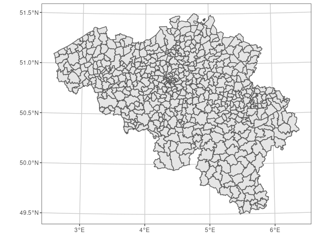
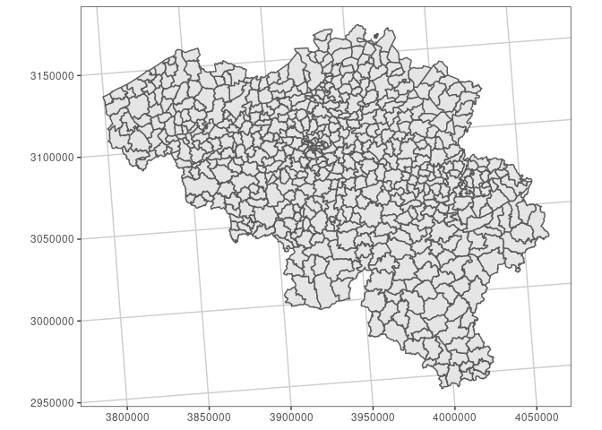
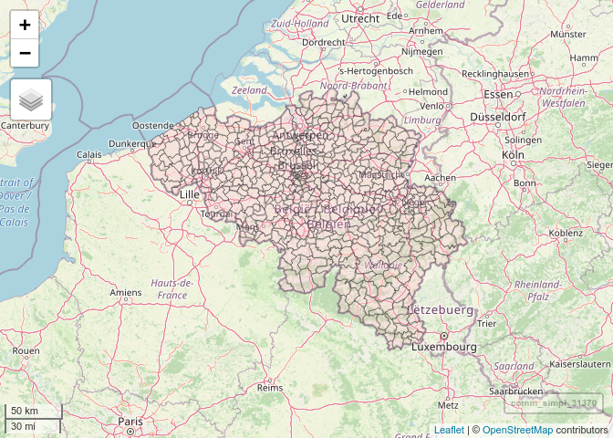
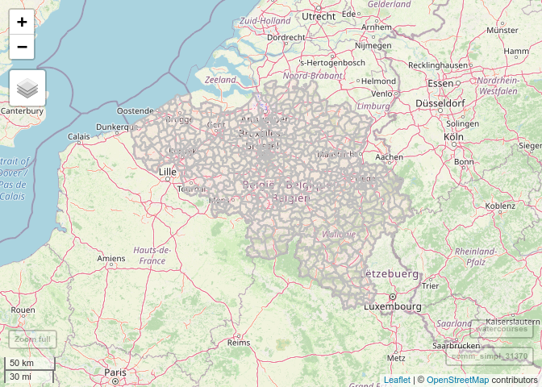
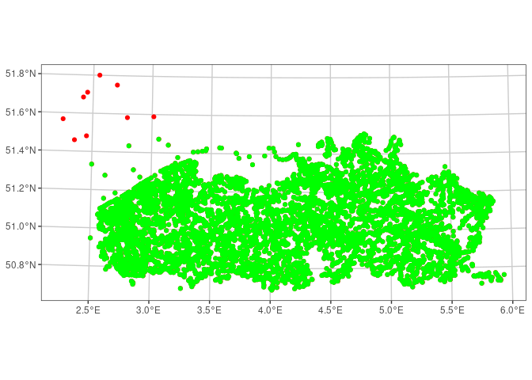
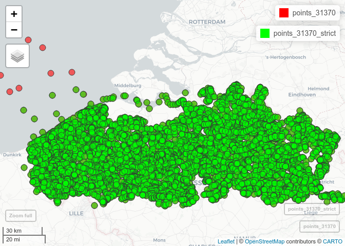

## Introduction and setup

This tutorial originated while preparing an R-demonstration during a GIS
club at INBO on 16 September 2021. (Further material of the GIS club is
available
[here](https://drive.google.com/drive/folders/1s5HZ5VjnkTbCQSE1vfFyMJz6PVIl4mHW).)

A straightforward approach for transforming spatial data is available in
another [tutorial](../spatial_transform_crs/). The current tutorial
tackles a few extra aspects.

The tutorial assumes you have some pre-existing knowledge:

-   Basic knowledge about coordinate reference systems (CRSs) and
    geodetic datums; see [another tutorial](../spatial_crs_coding/) and
    the references and links therein.
-   Knowing how to read geospatial files with
    [`sf`](https://r-spatial.github.io/sf). There is another
    [tutorial](../spatial_standards_vector/) demonstrating some aspects.

In this tutorial we will apply conversions (without datum shift) and
transformations (with datum shift) to `sf` and `sfc` objects. In the
background, these operations use the [PROJ](https://proj.org) library.

Let’s load the needed R packages and prepare a more appropriate theme
for mapping with [`ggplot2`](https://ggplot2.tidyverse.org/):

``` r
library(dplyr)
library(sf)
library(ggplot2)
theme_set(theme_bw())
theme_update(panel.grid = element_line(colour = "grey80"))
library(mapview)
```

Set up input data if needed:

``` r
if (!file.exists(file.path(gisclubdata_path, "gemeenten_belgie.shp"))) {
  googledrive::drive_download(googledrive::as_id("1oi-XvO54beBKcoTfbjVd8QRz-0j3Upfx"), 
                              file.path(gisclubdata_path, "data_gisclub.zip"))
  unzip(file.path(gisclubdata_path, "data_gisclub.zip"),
        exdir = gisclubdata_path)
}
```

The code assumes that you have a `gisclubdata_path` object defined
(directory path as a string).

## Joining and mapping polygon layers

For a given `municipalities` and `watercourses` dataset, we would like
to append the municipality name to the watercourses by making a spatial
join.

### Reading data and trying to join

Let’s read the data file of Belgian municipalities:

``` r
path_municipalities <- file.path(gisclubdata_path, "gemeenten_belgie.shp")
municipalities <- read_sf(path_municipalities)
```

It looks like this:

``` r
municipalities
```

    Simple feature collection with 581 features and 3 fields
    Geometry type: MULTIPOLYGON
    Dimension:     XYZ
    Bounding box:  xmin: 2.541331 ymin: 49.49695 xmax: 6.408098 ymax: 51.50511
    z_range:       zmin: 0 zmax: 0
    Geodetic CRS:  WGS 84
    # A tibble: 581 × 4
       T_MUN_NL        Shape_Leng Shape_Area                                geometry
       <chr>                <dbl>      <dbl>                      <MULTIPOLYGON [°]>
     1 ’s Gravenbrakel      0.759    0.0108  Z (((4.095037 50.66599 0, 4.095101 50.…
     2 Aalst                0.676    0.0101  Z (((4.054666 50.99444 0, 4.054666 50.…
     3 Aalter               0.735    0.0154  Z (((3.41099 51.15987 0, 3.41275 51.15…
     4 Aarlen               0.951    0.0148  Z (((5.860749 49.72667 0, 5.860889 49.…
     5 Aarschot             0.640    0.00807 Z (((4.927684 51.03717 0, 4.92797 51.0…
     6 Aartselaar           0.265    0.00141 Z (((4.401293 51.14814 0, 4.400461 51.…
     7 Aat                  0.977    0.0163  Z (((3.756864 50.69743 0, 3.757621 50.…
     8 Affligem             0.261    0.00229 Z (((4.114181 50.92559 0, 4.115272 50.…
     9 Aiseau-Presles       0.393    0.00284 Z (((4.584122 50.43827 0, 4.584458 50.…
    10 Alken                0.336    0.00361 Z (((5.275147 50.9102 0, 5.275645 50.9…
    # … with 571 more rows

It appears that the points have three coordinate dimensions (`XYZ`).
However the features have only two useful dimensions:

``` r
st_dimension(municipalities)
```

      [1] 2 2 2 2 2 2 2 2 2 2 2 2 2 2 2 2 2 2 2 2 2 2 2 2 2 2 2 2 2 2 2 2 2 2 2 2 2
     [38] 2 2 2 2 2 2 2 2 2 2 2 2 2 2 2 2 2 2 2 2 2 2 2 2 2 2 2 2 2 2 2 2 2 2 2 2 2
     [75] 2 2 2 2 2 2 2 2 2 2 2 2 2 2 2 2 2 2 2 2 2 2 2 2 2 2 2 2 2 2 2 2 2 2 2 2 2
    [112] 2 2 2 2 2 2 2 2 2 2 2 2 2 2 2 2 2 2 2 2 2 2 2 2 2 2 2 2 2 2 2 2 2 2 2 2 2
    [149] 2 2 2 2 2 2 2 2 2 2 2 2 2 2 2 2 2 2 2 2 2 2 2 2 2 2 2 2 2 2 2 2 2 2 2 2 2
    [186] 2 2 2 2 2 2 2 2 2 2 2 2 2 2 2 2 2 2 2 2 2 2 2 2 2 2 2 2 2 2 2 2 2 2 2 2 2
    [223] 2 2 2 2 2 2 2 2 2 2 2 2 2 2 2 2 2 2 2 2 2 2 2 2 2 2 2 2 2 2 2 2 2 2 2 2 2
    [260] 2 2 2 2 2 2 2 2 2 2 2 2 2 2 2 2 2 2 2 2 2 2 2 2 2 2 2 2 2 2 2 2 2 2 2 2 2
    [297] 2 2 2 2 2 2 2 2 2 2 2 2 2 2 2 2 2 2 2 2 2 2 2 2 2 2 2 2 2 2 2 2 2 2 2 2 2
    [334] 2 2 2 2 2 2 2 2 2 2 2 2 2 2 2 2 2 2 2 2 2 2 2 2 2 2 2 2 2 2 2 2 2 2 2 2 2
    [371] 2 2 2 2 2 2 2 2 2 2 2 2 2 2 2 2 2 2 2 2 2 2 2 2 2 2 2 2 2 2 2 2 2 2 2 2 2
    [408] 2 2 2 2 2 2 2 2 2 2 2 2 2 2 2 2 2 2 2 2 2 2 2 2 2 2 2 2 2 2 2 2 2 2 2 2 2
    [445] 2 2 2 2 2 2 2 2 2 2 2 2 2 2 2 2 2 2 2 2 2 2 2 2 2 2 2 2 2 2 2 2 2 2 2 2 2
    [482] 2 2 2 2 2 2 2 2 2 2 2 2 2 2 2 2 2 2 2 2 2 2 2 2 2 2 2 2 2 2 2 2 2 2 2 2 2
    [519] 2 2 2 2 2 2 2 2 2 2 2 2 2 2 2 2 2 2 2 2 2 2 2 2 2 2 2 2 2 2 2 2 2 2 2 2 2
    [556] 2 2 2 2 2 2 2 2 2 2 2 2 2 2 2 2 2 2 2 2 2 2 2 2 2 2

Some tools – e.g. spherical geoprocessing – expect XY data. So we will
drop the Z dimension with `st_zm()`. Meanwhile we select the only
necessary attribute and rename it, using `select()`.

``` r
municipalities <- 
  municipalities %>% 
  select(municipality = T_MUN_NL) %>% 
  st_zm()
```

We perform similar operations on the `watercourses` dataset. Here, data
are already defined as two dimensions.

``` r
path_watercourses <- file.path(gisclubdata_path, "watergangen_antw.shp")
watercourses <- read_sf(path_watercourses)
```

``` r
watercourses
```

    Simple feature collection with 7258 features and 14 fields
    Geometry type: POLYGON
    Dimension:     XY
    Bounding box:  xmin: 138050.5 ymin: 201644.5 xmax: 162761.3 ymax: 230509
    CRS:           NA
    # A tibble: 7,258 × 15
         OIDN   UIDN VERSIE BEGINDATUM VERSDATUM   VHAG NAAM       OPNDATUM   BGNINV
        <dbl>  <dbl>  <int> <date>     <date>     <dbl> <chr>      <date>      <int>
     1 205462 492073      3 2017-07-05 2021-05-06  3320 nvt        2017-06-20     13
     2 179828 488809      2 2015-01-20 2021-05-06    -9 nvt        2014-12-02      4
     3 223031 499842      2 2018-03-28 2021-05-06 54710 Kallebeek… 2018-02-27      4
     4 267383 462960      2 2020-02-22 2021-05-06    -9 nvt        2020-01-08      4
     5  72361 481073      3 2010-11-08 2021-05-06 65101 nvt        2020-06-22      6
     6 223073 499879      3 2018-03-28 2021-05-06    -9 nvt        2018-02-27     13
     7  72079 480970      3 2010-11-08 2021-05-06 53460 nvt        2016-06-20      3
     8 145811 567202      3 2012-11-20 2021-07-07    -8 ng         2012-10-19     11
     9 205453 492064      3 2017-07-05 2021-05-06    -9 nvt        2017-06-20     10
    10 269842 463401      2 2020-04-22 2021-05-06    -9 nvt        2020-04-03      4
    # … with 7,248 more rows, and 6 more variables: LBLBGNINV <chr>, LENGTE <dbl>,
    #   OPPERVL <dbl>, Shape_Leng <dbl>, Shape_Area <dbl>, geometry <POLYGON>

Note that not all columns are printed. Let’s preview all columns with
`glimpse()`:

``` r
glimpse(watercourses)
```

    Rows: 7,258
    Columns: 15
    $ OIDN       <dbl> 205462, 179828, 223031, 267383, 72361, 223073, 72079, 14581…
    $ UIDN       <dbl> 492073, 488809, 499842, 462960, 481073, 499879, 480970, 567…
    $ VERSIE     <int> 3, 2, 2, 2, 3, 3, 3, 3, 3, 2, 1, 2, 2, 1, 2, 1, 2, 3, 2, 3,…
    $ BEGINDATUM <date> 2017-07-05, 2015-01-20, 2018-03-28, 2020-02-22, 2010-11-08…
    $ VERSDATUM  <date> 2021-05-06, 2021-05-06, 2021-05-06, 2021-05-06, 2021-05-06…
    $ VHAG       <dbl> 3320, -9, 54710, -9, 65101, -9, 53460, -8, -9, -9, -9, -9, …
    $ NAAM       <chr> "nvt", "nvt", "Kallebeekgeul", "nvt", "nvt", "nvt", "nvt", …
    $ OPNDATUM   <date> 2017-06-20, 2014-12-02, 2018-02-27, 2020-01-08, 2020-06-22…
    $ BGNINV     <int> 13, 4, 4, 4, 6, 13, 3, 11, 10, 4, 1, 4, 4, 1, 4, 4, 1, 13, …
    $ LBLBGNINV  <chr> "aanmaak uniek percelenplan\r\n", "bijhouding binnengebiede…
    $ LENGTE     <dbl> 570.19, 185.33, 1491.01, 307.60, 286.06, 270.32, 48.11, 17.…
    $ OPPERVL    <dbl> 2492.23, 494.77, 9350.36, 978.46, 432.97, 405.56, 118.29, 1…
    $ Shape_Leng <dbl> 570.18844, 185.32549, 1491.01243, 307.59691, 286.06075, 270…
    $ Shape_Area <dbl> 2492.22527, 494.77446, 9350.36080, 978.46010, 432.97004, 40…
    $ geometry   <POLYGON> POLYGON ((141976.5 222453.1..., POLYGON ((142200.6 2050…

We only select some:

``` r
watercourses <- 
  watercourses %>% 
  select(polygon_id = OIDN,
         vhag_code = VHAG,
         watercourse = NAAM)
```

``` r
watercourses
```

    Simple feature collection with 7258 features and 3 fields
    Geometry type: POLYGON
    Dimension:     XY
    Bounding box:  xmin: 138050.5 ymin: 201644.5 xmax: 162761.3 ymax: 230509
    CRS:           NA
    # A tibble: 7,258 × 4
       polygon_id vhag_code watercourse                                     geometry
            <dbl>     <dbl> <chr>                                          <POLYGON>
     1     205462      3320 nvt           ((141976.5 222453.1, 141973.1 222449.6, 1…
     2     179828        -9 nvt           ((142200.6 205085.9, 142197.3 205085, 142…
     3     223031     54710 Kallebeekgeul ((146874.6 203777.1, 146879.3 203775.9, 1…
     4     267383        -9 nvt           ((148997 209136.1, 148996.7 209136.1, 148…
     5      72361     65101 nvt           ((141780.9 213697.8, 141780.7 213695.3, 1…
     6     223073        -9 nvt           ((144377.8 205161.2, 144408.7 205152.8, 1…
     7      72079     53460 nvt           ((140094.1 210962.7, 140093.8 210962.5, 1…
     8     145811        -8 ng            ((149004.6 209659.9, 149002.5 209666.4, 1…
     9     205453        -9 nvt           ((139682 225241.4, 139697.5 225222, 13971…
    10     269842        -9 nvt           ((155762.1 207273.7, 155766.5 207273, 155…
    # … with 7,248 more rows

In the above prints of the `municipalities` and `watercourses` objects,
you could already see their coordinate reference system (CRS). With
`st_crs()` you can extract the `crs` object; it is printed as:

``` r
st_crs(municipalities)
```

    Coordinate Reference System:
      User input: WGS 84 
      wkt:
    GEOGCRS["WGS 84",
        DATUM["World Geodetic System 1984",
            ELLIPSOID["WGS 84",6378137,298.257223563,
                LENGTHUNIT["metre",1]]],
        PRIMEM["Greenwich",0,
            ANGLEUNIT["degree",0.0174532925199433]],
        CS[ellipsoidal,2],
            AXIS["latitude",north,
                ORDER[1],
                ANGLEUNIT["degree",0.0174532925199433]],
            AXIS["longitude",east,
                ORDER[2],
                ANGLEUNIT["degree",0.0174532925199433]],
        ID["EPSG",4326]]

The CRS name ‘WGS 84’ can also be returned by
`st_crs(municipalities)$Name`. As seen from the WKT string, this is a
geographical CRS.

However for `watercourses` the CRS is missing:

``` r
st_crs(watercourses)
```

    Coordinate Reference System: NA

Can we make the spatial join already?

``` r
st_join(watercourses, municipalities) %>% try
```

    Error in st_geos_binop("intersects", x, y, sparse = sparse, prepared = prepared,  : 
      st_crs(x) == st_crs(y) is not TRUE

Fortunately, this doesn’t work: `st_join()` requires its inputs to
belong to the same CRS.

Well, we know that `watercourses` is in the projected CRS `EPSG:31370`
(Belge 1972 / Belgian Lambert 72), so we can just update it:

``` r
st_crs(watercourses) <- "EPSG:31370"
```

Since the CRSs are still different, this should *not* be sufficient for
the join.

``` r
st_join(watercourses, municipalities) %>% try
```

    Error in st_geos_binop("intersects", x, y, sparse = sparse, prepared = prepared,  : 
      st_crs(x) == st_crs(y) is not TRUE

Indeed!

Let’s transform `municipalities` to `EPSG:31370`:

``` r
municipalities_31370 <- st_transform(municipalities, "EPSG:31370")
```

And now…

``` r
(watercourses_comm <- st_join(watercourses, municipalities_31370))
```

    Simple feature collection with 7502 features and 4 fields
    Geometry type: POLYGON
    Dimension:     XY
    Bounding box:  xmin: 138050.5 ymin: 201644.5 xmax: 162761.3 ymax: 230509
    Projected CRS: Belge 1972 / Belgian Lambert 72
    # A tibble: 7,502 × 5
       polygon_id vhag_code watercourse                        geometry municipality
     *      <dbl>     <dbl> <chr>                         <POLYGON [m]> <chr>       
     1     205462      3320 nvt           ((141976.5 222453.1, 141973.… Beveren     
     2     179828        -9 nvt           ((142200.6 205085.9, 142197.… Kruibeke    
     3     223031     54710 Kallebeekgeul ((146874.6 203777.1, 146879.… Kruibeke    
     4     267383        -9 nvt           ((148997 209136.1, 148996.7 … Antwerpen   
     5      72361     65101 nvt           ((141780.9 213697.8, 141780.… Beveren     
     6     223073        -9 nvt           ((144377.8 205161.2, 144408.… Kruibeke    
     7      72079     53460 nvt           ((140094.1 210962.7, 140093.… Beveren     
     8     145811        -8 ng            ((149004.6 209659.9, 149002.… Antwerpen   
     9     205453        -9 nvt           ((139682 225241.4, 139697.5 … Beveren     
    10     269842        -9 nvt           ((155762.1 207273.7, 155766.… Mortsel     
    # … with 7,492 more rows

Succeeded!

Two things to note here:

-   `st_join()` has an argument ‘`join`’ that defines the type of
    topological relationship that is used to either join or *not* join a
    geometry from the first layer with a geometry from the second.
    Various so-called ‘binary predicates’ can be used to define this
    relationship (see `?st_join`), but the default one is
    `st_intersects()`, i.e. an *intersection* as defined by the
    ‘[DE-9IM](https://en.wikipedia.org/wiki/DE-9IM)’ model of binary
    geometry relations.
-   Since several watercourses intersect more than one municipality,
    several of them are repeated in `watercourses_comm`, each with
    another values for `municipality`.

We chose to make the spatial join in the `EPSG:31370` CRS. However, we
can equally do it on a spherical model of the Earth, when using the
geographical coordinates. We expect the resulting joined attributes to
be equivalent. Let’s check:

``` r
st_join(st_transform(watercourses, "EPSG:4326"), municipalities) %>% 
  st_drop_geometry %>% 
  all.equal(watercourses_comm %>% st_drop_geometry)
```

    [1] TRUE

### Mapping

While it has only one attribute and 581 rows, the object size of
`municipalities_31370` is relatively large because its polygons have
numerous vertices:

``` r
object.size(municipalities_31370) %>% format(units = "MB")
```

    [1] "22.1 Mb"

This makes a simple map take long to render in R (not shown here; just
try yourself):

``` r
ggplot(data = municipalities_31370) + geom_sf()
```

For the sake of this exercise, we make a simplified derived object
`comm_simpl_31370` with fewer vertices:

``` r
comm_simpl_31370 <- st_simplify(municipalities_31370, dTolerance = 10)
```

Its size is much smaller:

``` r
object.size(comm_simpl_31370) %>% format(units = "MB")
```

    [1] "3 Mb"

So it renders faster.

``` r
ggplot(data = comm_simpl_31370) + geom_sf()
```

<!-- -->

However, mind that the simplification may be OK for mapping at an
appropriate scale, but beware that information has been lost, so shapes
have changed and gaps + overlaps will appear between polygons. Hence
don’t use this simplified version if you process it further, or for
detailed mapping.

Note the latitude-longitude graticule: the map follows the CRS of the
plotted object, but the graticule is latitude-longitude by default.

We can plot the graticule of another CRS with `coord_sf()`:

``` r
ggplot(data = comm_simpl_31370) + geom_sf() + coord_sf(datum = "EPSG:31370")
```

<!-- -->

The above is the most obvious choice here, since it’s the CRS of the
object, but we could as well plot the graticule of e.g. `EPSG:3035`
(ETRS89-extended / LAEA Europe):

``` r
ggplot(data = comm_simpl_31370) + geom_sf() + coord_sf(datum = "EPSG:3035")
```

<!-- -->

Next to the [`ggplot2`](https://ggplot2.tidyverse.org/) package, which
we used above, interactive maps can be made with the
[`mapview`](https://r-spatial.github.io/mapview/) package.

Here too, time to render differs between:

``` r
mapview(municipalities_31370, legend = FALSE)
```

and:

``` r
mapview(comm_simpl_31370, legend = FALSE)
```

<!-- -->

In this case, `mapview` is using the `leaflet` package with some nice
defaults, but in the above examples it makes a color map by default
because there’s only one attribute. We don’t want this and we make some
further adjustments:

``` r
mapview(comm_simpl_31370, 
        col.regions = "pink", 
        alpha.regions = 0.3, 
        legend = FALSE,
        map.types = "OpenStreetMap")
```

<!-- -->

Note that a separate tutorial about `leaflet` is
[available](../spatial_create_leaflet_map/) on this website!

Beware that `mapview` and `leaflet` produce maps in the ‘WGS 84 /
Pseudo-Mercator’ CRS (`EPSG:3857`). For that to happen, `mapview`
transforms spatial objects on-the-fly. [Pseudo Mercator or Web
Mercator](https://proj.org/operations/projections/webmerc.html) is a
much used projection in web mapping because the coordinate projection is
computed much faster. However it should not be used in official mapping
or as a projected CRS for geoprocessing, since it has more distortions
(including shape) than e.g. the (truly) conformal Mercator projection
(e.g. in CRS `EPSG:3395` – WGS 84 / World Mercator – which is best used
in the equatorial region).

Let’s show two layers with `mapview`:

``` r
mapview(list(comm_simpl_31370, watercourses), 
        col.regions = c("pink", "blue"), 
        alpha.regions = c(0.2, 0.5),
        color = c("grey", NA), 
        legend = FALSE,
        map.types = "OpenStreetMap")
```

<!-- -->

## Different transformation pipelines

We consider a layer of points that correspond to locations where
characteristics were determined of Flemish surfacewater bodies:

``` r
path_points <- file.path(gisclubdata_path, "meetplaatsen_oppwater.shp")
points <- read_sf(path_points)
```

Check the CRS:

``` r
st_crs(points)
```

    Coordinate Reference System:
      User input: Amersfoort / RD New 
      wkt:
    PROJCRS["Amersfoort / RD New",
        BASEGEOGCRS["Amersfoort",
            DATUM["Amersfoort",
                ELLIPSOID["Bessel 1841",6377397.155,299.1528128,
                    LENGTHUNIT["metre",1]]],
            PRIMEM["Greenwich",0,
                ANGLEUNIT["degree",0.0174532925199433]],
            ID["EPSG",4289]],
        CONVERSION["RD New",
            METHOD["Oblique Stereographic",
                ID["EPSG",9809]],
            PARAMETER["Latitude of natural origin",52.1561605555556,
                ANGLEUNIT["degree",0.0174532925199433],
                ID["EPSG",8801]],
            PARAMETER["Longitude of natural origin",5.38763888888889,
                ANGLEUNIT["degree",0.0174532925199433],
                ID["EPSG",8802]],
            PARAMETER["Scale factor at natural origin",0.9999079,
                SCALEUNIT["unity",1],
                ID["EPSG",8805]],
            PARAMETER["False easting",155000,
                LENGTHUNIT["metre",1],
                ID["EPSG",8806]],
            PARAMETER["False northing",463000,
                LENGTHUNIT["metre",1],
                ID["EPSG",8807]]],
        CS[Cartesian,2],
            AXIS["easting (X)",east,
                ORDER[1],
                LENGTHUNIT["metre",1]],
            AXIS["northing (Y)",north,
                ORDER[2],
                LENGTHUNIT["metre",1]],
        USAGE[
            SCOPE["Engineering survey, topographic mapping."],
            AREA["Netherlands - onshore, including Waddenzee, Dutch Wadden Islands and 12-mile offshore coastal zone."],
            BBOX[50.75,3.2,53.7,7.22]],
        ID["EPSG",28992]]

The `points` object has the projected ‘Amersfoort / RD New’ CRS
(`EPSG:28992`), which was created for The Netherlands – onshore. See
e.g.
[Wikipedia](https://nl.wikipedia.org/wiki/Rijksdriehoeksco%C3%B6rdinaten)
for more background about this CRS.

Essentially we are dealing with a different projected CRS than
`EPSG:31370`. `EPSG:28992` uses the ‘Amersfoort’ geodetic datum, defined
using the ‘Bessel 1841’ ellipsoid, while `EPSG:31370` has the ‘Reseau
National Belge 1972’ datum, defined using the ‘International 1924’
ellipsoid.[1]

We will transform `points` (back) to `EPSG:31370` since the data are
outside the intended area of usage. Note that this dataset has been made
for mere demonstrative purposes: since at least a part of the points
fall outside the area of usage (geographic bounding box) of the
‘Amersfoort / RD New’ CRS, the dataset is not appropriate to start from.
But let’s suppose it is all one had available to work with!

### Standard approach

By default, the appropriate transformation pipeline (concatenated
coordinate operations) can differ between different areas that are
represented in a spatial dataset. This is taken care of automatically
based on the bounding boxes of each CRS, but it will also depend on the
availability of specific transformation grids.

``` r
points_31370 <- st_transform(points, "EPSG:31370")
```

Notice the completely different coordinate ranges between both CRSs:

``` r
st_geometry(points)
Geometry set for 7320 features 
Geometry type: POINT
Dimension:     XY
Bounding box:  xmin: -62470.03 ymin: 300542 xmax: 193543.8 ymax: 427302.7
Projected CRS: Amersfoort / RD New
First 5 geometries:
POINT (-30849.68 354341.7)
POINT (-31237.91 354683.3)
POINT (-28757.74 356391.3)
POINT (709.4341 373861.2)
POINT (116680.8 340639.1)
```

``` r
st_geometry(points_31370)
Geometry set for 7320 features 
Geometry type: POINT
Dimension:     XY
Bounding box:  xmin: 3174.827 ymin: 152992.4 xmax: 260391 ymax: 278347.1
Projected CRS: Belge 1972 / Belgian Lambert 72
First 5 geometries:
POINT (35483.62 205530.5)
POINT (35090.55 205866.5)
POINT (37545.94 207609.8)
POINT (66666.83 225461.1)
POINT (183089.2 193870.8)
```

A specific area shown with `ggplot2` in `EPSG:31370`:

``` r
ggplot() + 
  geom_sf(data = watercourses, fill = "lightblue", colour = "lightblue") +
  geom_sf(data = points_31370, fill = "red", shape = 21) +
  lims(x = c(154e3, 155e3), y = c(218e3, 219e3)) +
  coord_sf(datum = "EPSG:31370")
```

<!-- -->

### Enforcing a specific pipeline

We can request available transformation pipelines with
`sf_proj_pipelines()`:

``` r
pipelines <- sf_proj_pipelines("EPSG:28992", "EPSG:31370")
```

One can further limit this by specifying the area of interest (`aoi`
argument), which we didn’t do here.

It is a dataframe with following structure:

``` r
glimpse(pipelines)
```

    Rows: 13
    Columns: 9
    $ id           <chr> "pipeline", "pipeline", "pipeline", "pipeline", "pipeline…
    $ description  <chr> "Inverse of RD New + Amersfoort to ETRS89 (9) + Inverse o…
    $ definition   <chr> "+proj=pipeline +step +inv +proj=sterea +lat_0=52.1561605…
    $ has_inverse  <lgl> TRUE, TRUE, TRUE, TRUE, TRUE, TRUE, TRUE, TRUE, TRUE, TRU…
    $ accuracy     <dbl> 0.011, 0.201, 0.260, 0.450, 1.001, 1.250, 2.000, 2.000, 2…
    $ axis_order   <lgl> FALSE, FALSE, FALSE, FALSE, FALSE, FALSE, FALSE, FALSE, F…
    $ grid_count   <int> 2, 1, 1, 0, 1, 0, 0, 0, 0, 0, 0, 0, 0
    $ instantiable <lgl> TRUE, TRUE, TRUE, TRUE, TRUE, TRUE, TRUE, TRUE, TRUE, TRU…
    $ containment  <lgl> FALSE, FALSE, FALSE, FALSE, FALSE, FALSE, FALSE, FALSE, F…

Some metadata about the pipelines:

``` r
pipelines %>% 
  as_tibble %>% 
  select(definition, description, grid_count, accuracy, instantiable)
```

    # A tibble: 13 × 5
       definition             description           grid_count accuracy instantiable
       <chr>                  <chr>                      <int>    <dbl> <lgl>       
     1 +proj=pipeline +step … Inverse of RD New + …          2    0.011 TRUE        
     2 +proj=pipeline +step … Inverse of RD New + …          1    0.201 TRUE        
     3 +proj=pipeline +step … Inverse of RD New + …          1    0.26  TRUE        
     4 +proj=pipeline +step … Inverse of RD New + …          0    0.45  TRUE        
     5 +proj=pipeline +step … Inverse of RD New + …          1    1.00  TRUE        
     6 +proj=pipeline +step … Inverse of RD New + …          0    1.25  TRUE        
     7 +proj=pipeline +step … Inverse of RD New + …          0    2     TRUE        
     8 +proj=pipeline +step … Inverse of RD New + …          0    2     TRUE        
     9 +proj=pipeline +step … Inverse of RD New + …          0    2     TRUE        
    10 +proj=pipeline +step … Inverse of RD New + …          0    2     TRUE        
    11 +proj=pipeline +step … Inverse of RD New + …          0    6     TRUE        
    12 +proj=pipeline +step … Inverse of RD New + …          0    6     TRUE        
    13 +proj=pipeline +step … Inverse of RD New + …          0   NA     TRUE        

We can see that the first one has best accuracy. Several pipelines are
based on one or two grids for a better accuracy.

When printing the `pipelines` object, its first row is printed in a more
readable manner:

``` r
pipelines
```

    Candidate coordinate operations found:  13 
    Strict containment:     FALSE 
    Axis order auth compl:  FALSE 
    Source:  EPSG:28992 
    Target:  EPSG:31370 
    Best instantiable operation has accuracy: 0.011 m
    Description: Inverse of RD New + Amersfoort to ETRS89 (9) + Inverse of BD72
                 to ETRS89 (3) + Belgian Lambert 72
    Definition:  +proj=pipeline +step +inv +proj=sterea +lat_0=52.1561605555556
                 +lon_0=5.38763888888889 +k=0.9999079 +x_0=155000
                 +y_0=463000 +ellps=bessel +step +proj=hgridshift
                 +grids=nl_nsgi_rdtrans2018.tif +step +inv
                 +proj=hgridshift
                 +grids=be_ign_bd72lb72_etrs89lb08.tif +step
                 +proj=lcc +lat_0=90 +lon_0=4.36748666666667
                 +lat_1=51.1666672333333 +lat_2=49.8333339
                 +x_0=150000.013 +y_0=5400088.438 +ellps=intl

Since the rows of pipelines are sorted by `instantiable` and `accuracy`,
it makes sense to designate the printed pipeline as *Best instantiable
operation*.

It follows that the same information appears when manually selecting and
then printing, except for the number of ‘candidate operations found’:

``` r
pipelines[1,]
```

    Candidate coordinate operations found:  1 
    Strict containment:     FALSE 
    Axis order auth compl:  FALSE 
    Source:  EPSG:28992 
    Target:  EPSG:31370 
    Best instantiable operation has accuracy: 0.011 m
    Description: Inverse of RD New + Amersfoort to ETRS89 (9) + Inverse of BD72
                 to ETRS89 (3) + Belgian Lambert 72
    Definition:  +proj=pipeline +step +inv +proj=sterea +lat_0=52.1561605555556
                 +lon_0=5.38763888888889 +k=0.9999079 +x_0=155000
                 +y_0=463000 +ellps=bessel +step +proj=hgridshift
                 +grids=nl_nsgi_rdtrans2018.tif +step +inv
                 +proj=hgridshift
                 +grids=be_ign_bd72lb72_etrs89lb08.tif +step
                 +proj=lcc +lat_0=90 +lon_0=4.36748666666667
                 +lat_1=51.1666672333333 +lat_2=49.8333339
                 +x_0=150000.013 +y_0=5400088.438 +ellps=intl

If you’d like to get even more metadata on the available pipelines,
including the WKT definitions, you can also run PROJ’s
[`projinfo`](https://proj.org/apps/projinfo.html) command line program
from within R if it’s available in your system `PATH`.

``` r
system("projinfo -s EPSG:28992 -t EPSG:31370 --spatial-test intersects -o WKT2:2019")
```

The *default* operation returned by PROJ’s `projinfo`, based on the
union of the source and target CRS’s bounding box, appears to be just
one pipeline with so-called [ballpark
accuracy](https://proj.org/glossary.html#term-Ballpark-transformation).
It’s obtained by dropping the `--spatial-test intersects` option (or
replacing `intersects` by `contains`, which is default), and so it
matches the pipeline where `accuracy` equals `NA` in our `pipelines`
dataframe:

``` r
pipelines[13,]
```

    Candidate coordinate operations found:  1 
    Strict containment:     FALSE 
    Axis order auth compl:  FALSE 
    Source:  EPSG:28992 
    Target:  EPSG:31370 
    Best instantiable operation has only ballpark accuracy 
    Description: Inverse of RD New + Ballpark geographic offset from Amersfoort
                 to Belge 1972 + Belgian Lambert 72
    Definition:  +proj=pipeline +step +inv +proj=sterea +lat_0=52.1561605555556
                 +lon_0=5.38763888888889 +k=0.9999079 +x_0=155000
                 +y_0=463000 +ellps=bessel +step +proj=lcc
                 +lat_0=90 +lon_0=4.36748666666667
                 +lat_1=51.1666672333333 +lat_2=49.8333339
                 +x_0=150000.013 +y_0=5400088.438 +ellps=intl

The low accuracy of a ballpark transformation is because datum
differences between source and target CRSs are neglected:

> It does not attempt any datum shift, hence the “ballpark” qualifier in
> its name. Its accuracy is unknown, and could lead in some cases to
> errors of a few hundreds of metres.

*(Source:
<https://proj.org/glossary.html#term-Ballpark-transformation>)*

With `st_transform()` we can enforce a specific pipeline. Note that it
is only available for `sfc` objects, not `sf` objects.

Let’s apply the most accurate pipeline to *all* points:

``` r
# We select the pipeline with lowest accuracy (< 0.02), by filtering on accuracy.
# If the grids are installed, this should match the first line of the pipelines object.
chosen_pipeline_definition <- pipelines %>% filter(accuracy < 0.02) %>% pull(definition)
points_31370_strict <- 
  st_transform(st_geometry(points), "EPSG:31370",
               pipeline = chosen_pipeline_definition) %>% 
  st_sf(st_drop_geometry(points), geometry = .) %>% 
  as_tibble %>% 
  st_as_sf
```

And compare:

``` r
st_geometry(points_31370)
Geometry set for 7320 features 
Geometry type: POINT
Dimension:     XY
Bounding box:  xmin: 3174.827 ymin: 152992.4 xmax: 260391 ymax: 278347.1
Projected CRS: Belge 1972 / Belgian Lambert 72
First 5 geometries:
POINT (35483.62 205530.5)
POINT (35090.55 205866.5)
POINT (37545.94 207609.8)
POINT (66666.83 225461.1)
POINT (183089.2 193870.8)
```

``` r
st_geometry(points_31370_strict)
Geometry set for 7320 features  (with 9 geometries empty)
Geometry type: POINT
Dimension:     XY
Bounding box:  xmin: 18976.03 ymin: 152963.3 xmax: 260391 ymax: 244024
Projected CRS: Belge 1972 / Belgian Lambert 72
First 5 geometries:
POINT (35393.39 205495.3)
POINT (35000.39 205831.3)
POINT (37455.41 207574.3)
POINT (66666.83 225461.1)
POINT (183089.2 193870.8)
```

Notice the **9 empty geometries** in case of `points_31370_strict`!

What is happening?

``` r
p <- 
  ggplot() + 
  geom_sf(data = points_31370, colour = "red") +
  geom_sf(data = points_31370_strict, colour = "green") 
p
```

<!-- -->

It appears that points too far at sea are considered invalid when
applying this pipeline, and their geometry was cleared (although the
corresponding row was not dropped).

If we make a zoomable plot, there’s more to discover.

``` r
plotly::ggplotly(p)
```

<!-- -->

Most points on the map are on the exact same location between both
approaches. We can see that points west and south of the *geographic
bounding box* for usage of the Dutch CRS have a different position
depending on the applied approach.

It can be further investigated with `mapview` (note that this does a
further reprojection to `EPSG:3857`):

``` r
mapview(list(points_31370, points_31370_strict),
        col.regions = c("red", "green"))
```

<!-- -->

Here it appears that the western and southern points of `points_31370`
were transformed with the ballpark-accuracy pipeline: they are way off
the surfacewater bodies!

In this case, one might prefer enforcing the specific pipeline outside
the geographic bounding box of `EPSG:28992`, as we did for
`points_31370_strict`. However best explore the other pipelines as well,
e.g. the most accurate one that doesn’t depend on a grid, and consider
using that outside the geographic bounding box.

## Further reading and more packages

Much more information can be found in the online books by [Pebesma &
Bivand](#ref-pebesma_spatial_2021) ([2021](#ref-pebesma_spatial_2021))
and [Lovelace *et al.*](#ref-lovelace_geocomputation_2019)
([2019](#ref-lovelace_geocomputation_2019)). The `sf` package has a nice
website at <https://r-spatial.github.io/sf>; version 0.6-1 was
introduced in [Pebesma](#ref-pebesma_simple_2018)
([2018](#ref-pebesma_simple_2018)).

There are several more R packages to make beautiful maps. We
specifically mention [`tmap`](https://r-tmap.github.io/tmap/)
([Tennekes, 2018](#ref-tennekes_tmap_2018)) and
[`mapsf`](https://riatelab.github.io/mapsf/) for making production-ready
thematic maps. `tmap` is used a lot in [Lovelace *et
al.*](#ref-lovelace_geocomputation_2019)
([2019](#ref-lovelace_geocomputation_2019)).

Further, there is the
[`plotKML`](https://plotkml.r-forge.r-project.org/) package, which
renders spatial objects in Google Earth ([Hengl *et al.*,
2015](#ref-hengl_plotkml:_2015))!

## Bibliography

<div id="refs" class="references csl-bib-body hanging-indent">

<div id="ref-hengl_plotkml:_2015" class="csl-entry">

Hengl T., Roudier P., Beaudette D. & Pebesma E. (2015). plotKML:
Scientific Visualization of Spatio-Temporal Data. Journal of Statistical
Software 63. <http://www.geostat-course.org/system/files/jss1079.pdf>.

</div>

<div id="ref-lovelace_geocomputation_2019" class="csl-entry">

Lovelace R., Nowosad J. & Muenchow J. (2019). Geocomputation with R.
<https://geocompr.robinlovelace.net/>.

</div>

<div id="ref-pebesma_simple_2018" class="csl-entry">

Pebesma E. (2018). Simple Features for R: Standardized Support for
Spatial Vector Data. The R Journal 10 (1): 439–446.
<https://journal.r-project.org/archive/2018/RJ-2018-009/index.html>.

</div>

<div id="ref-pebesma_spatial_2021" class="csl-entry">

Pebesma E. & Bivand R. (2021). Spatial Data Science.
<https://r-spatial.org/book>.

</div>

<div id="ref-tennekes_tmap_2018" class="csl-entry">

Tennekes M. (2018). tmap: Thematic Maps in R. Journal of Statistical
Software 84 (1): 1–39. <https://doi.org/10.18637/jss.v084.i06>.

</div>

</div>

[1] Note that several European countries, including Belgium, now provide
national projected CRSs that use the common ETRS89 datum (European
Terrestrial Reference System 1989). An example is the Belgian CRS
`EPSG:3812` (ETRS89 / Belgian Lambert 2008).
